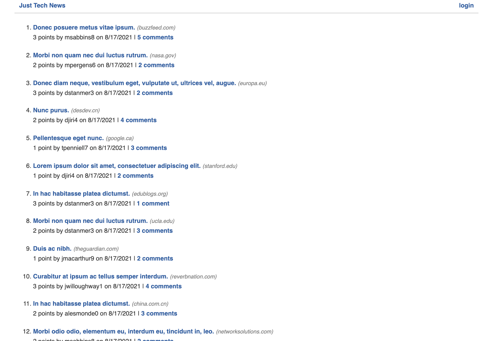

# just-tech-news

## Description
Just-Tech-News is a blog app where a user can create an account and be able to create a post from an article. 

## Table of Contents (Optional)

If your README is very long, add a table of contents to make it easy for users to find what they need.

* [Installation](#installation)
* [Usage](#usage)
* [Credits](#credits)
* [License](#license)

## Installation

`npm i` 

## Usage 

To use the 
1. Open the terminal 
2. Run `npm start`
3. Open localhost on browser

---

🏆 
## Badges

## Contributing / Credits

[mariamv29](https://github.com/mariamv29/README-generator.git)